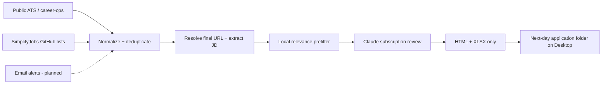

<div align="center">

# Daily Job Match Alert

**Subscription-only AI job discovery for Data and AI/ML candidates.**

Collect fresh roles from public ATS boards and curated GitHub lists; compare every relevant JD against two resumes; wake up to a ranked local report even when a source, the model, or an input file fails overnight.

[](https://github.com/JackyJiang08/daily-job-match-alert/actions/workflows/ci.yml)
[](LICENSE)


</div>

Daily Job Match Alert is a privacy-conscious, non-auto-apply pipeline for internships, new-grad positions, and entry-level full-time roles. It uses an authenticated **Claude Code subscription** for semantic matching—never a pay-as-you-go model API.

## Why Daily Job Match Alert

Job boards fragment discovery across ATS pages, curated lists, account alerts, and email. A single generic resume score also hides whether a role fits a Data profile or an AI/ML profile better.

Daily Job Match Alert provides:

- Dual-resume evaluation with independent Data and AI/ML scores.
- Subscription-only semantic review with structured, auditable output and a recorded scoring model.
- Public-source ingestion without authenticated scraping; an email-alert channel is planned but not enabled yet.
- Exact `postedAt` versus first-seen `discoveredAt` semantics.
- Cross-source URL canonicalization and persistent deduplication.
- Degrade-don't-die operation: failed collectors, unreachable postings, an unavailable model, or a corrupted input file become report warnings instead of a missing nightly report. `npm run chaos` proves this on every CI run.
- Exactly two user-facing files per successful application date: an HTML report with the complete captured JD and a compact 11-column XLSX with clickable posting links.
- Hard safety boundaries: no auto-apply, no screening answers, no mailbox mutation.

## Architecture



The local prefilter removes clearly unrelated roles before subscription review. Final report scores come from the configured subscription CLI; intermediate structured data stays in temporary local storage and is removed after XLSX creation.

## Discovery paths

| Source | Method | Status |
|---|---|---|
| SimplifyJobs Summer Internships | Public GitHub README polling | Enabled by default |
| SimplifyJobs New Grad | Public GitHub README polling | Enabled by default |
| Greenhouse and other supported ATS | `career-ops` scan history and final employer links | Optional (`sources.careerOps`) |
| `.eml` drop folder (`intake/eml`) | Local files parsed nightly | Collector runs, no mail is routed to it yet |
| Handshake / Simplify / Wellfound / ZipRecruiter / Jobright alerts | Official alert email via a Himalaya mailbox folder | **Planned, not enabled** (`sources.himalaya.enabled: false`) |

Daily Job Match Alert does not sign into or scrape Handshake, Jobright, Simplify, Wellfound, or ZipRecruiter. When the email channel is enabled, alert email is only a discovery mechanism; once a link resolves to a public employer ATS, the employer posting becomes the preferred source.

## Quick start

Requirements: macOS or Linux, Node.js 20+, and a subscription-authenticated Claude Code **2.1.250 or newer** (older versions are rejected before any batch is sent). [career-ops](https://github.com/santifer/career-ops) and [Himalaya](https://github.com/pimalaya/himalaya) are optional.

```bash
git clone https://github.com/JackyJiang08/daily-job-match-alert.git
cd daily-job-match-alert
cp config.example.json config.json
cp resumes/data.example.md resumes/data.md
cp resumes/ai.example.md resumes/ai.md
```

Point `resumeSources.dataPdf` and `resumeSources.aiPdf` at your private PDFs, edit the preferences in `config.json`, then sign in to Claude Code with your Claude subscription:

```bash
claude auth login --claudeai
claude auth status --json
claude --version

npm run resume:sync
npm test
npm run run
```

The default engine is `claude_subscription`. Choose the Claude.ai subscription flow—never `--console`, which is the API-billed path. If `claude` is outside the non-interactive system `PATH`, set `semanticMatching.claudeCommand` to its absolute executable path.

### Pinning and auditing the scoring model

`semanticMatching.model` is passed to `claude --model`. Use one of the Claude Code aliases—`fable`, `opus`, or `sonnet`, each resolving to the latest model in that family—or a full model name such as `claude-fable-5`. The example configuration pins `fable`.

Every batch response from `claude --print --output-format json` is parsed for the model that actually produced the scores (`modelUsage`, keyed by model id; the entry with the most output tokens is the scoring model). That value is recorded as `scoringModel` on each reviewed job, summarized as `meta.scoringModel`, and shown in the HTML header and the XLSX Run Summary as **Scoring model**. If the output does not identify a model, `scoringModel` is `unknown` and a warning is raised. If a configured model does not match the reported model after alias expansion (for example `fable` configured but `claude-sonnet-5` reported), the scores are still used for that run, but a `MODEL MISMATCH` warning appears in the HTML warning panel and the Run Summary so the configuration can be fixed. Runs without any semantic review show `local_only` or `none`.

## Deterministic eligibility filter

Two constraints are facts, not judgment calls, so they are enforced in code (`src/eligibility.mjs`) inside `isEligible` for every posting, whether it was scored by the subscription model, kept as a local fallback, or run with `engine: local_only`:

- **Location.** A location naming a non-US country, region, or city (`Canada`, `Remote – UK`, `Bengaluru, India`, `Remote - Europe`, …; the list `NON_US_LOCATION_MARKERS` is meant to be extended) excludes the posting. Any US marker (`United States`, `USA`, `US`, a state name, a `, ST` code, or a well-known US city) passes, and it wins over a non-US marker in the same string so multi-location postings reach the semantic review. A location that only says `Remote`, or is empty, passes but carries the gap **Location unverified — confirm US eligibility**, a yellow `Location unverified` chip on the HTML card, and the same text in the XLSX Gaps column.
- **Graduation window.** `preferences.graduationDate` (`2027-05` in the example) drives a short list of rules, each documented in `GRADUATION_EXCLUSION_RULES`: `Class of 2026`, `graduating by/before/no later than <date before the graduation month>`, `graduation date between … and <earlier date>`, and `must be able to start/work full-time <before the month after graduation>` (skipped for internships). A rule only fires when every date it finds is too early; `Class of 2026 or 2027`, `by 2027`, `December 2026 or later`, and single-date phrases without a bound are left to the semantic review. When `graduationDate` is missing, the rule set is disabled and a warning says so.

Excluded postings are counted, not listed one by one: a single `eligibility / hard filter` warning carries the totals and up to five examples, and both the HTML header and the XLSX Run Summary show **Excluded: location outside US** and **Excluded: graduation window**. Excluded postings are still marked as seen.

## Private resume updates

`resumeSources.autoRefresh` makes resume updates non-fixed. Before every run, the project hashes both source PDFs and refreshes the gitignored `resumes/data.md` and `resumes/ai.md` whenever either PDF changes. Replacing a PDF at the same path requires no configuration change; if its filename or folder changes, update only your private `config.json`.

Real PDFs, extracted resume text, `config.json`, state, email, logs, and generated reports are excluded from Git. The public repository contains examples and extraction code only.

## Subscription-only cost guard

This is an enforced runtime boundary, not just a documentation promise:

- `claude_subscription` is the only model engine (`local_only` skips semantic review). It requires Claude Code 2.1.250+ and checks `claude auth status --json` against an allow-list: `loggedIn` must be true, `authMethod` must be `claude.ai`/`claudeai`/`subscription`, `apiProvider` (when reported) must be `firstParty`, and `subscriptionType` (when reported) must be `pro`, `max`, `team`, or `enterprise`. `console` (Anthropic Console billing), `apiKey`, Bedrock, Vertex, and anything unrecognized are rejected with the observed `authMethod` in the warning, and the run falls back to local scoring.
- Before the CLI is spawned, every variable that could change its authentication or routing is removed from the subprocess environment: everything prefixed `ANTHROPIC_` (API key, base URL, auth token, model overrides) or `AWS_` (Bedrock credentials, profiles, regions), plus `CLAUDE_CODE_USE_BEDROCK`, `CLAUDE_CODE_USE_VERTEX`, `GOOGLE_APPLICATION_CREDENTIALS`, `GOOGLE_API_KEY`, `CLOUD_ML_REGION`, `CLAUDE_API_KEY`, and `OPENAI_API_KEY`.
- There is no Anthropic API client in the project, and no other model CLI is wired in.
- Authentication, version, batch, or parsing failures fall back to local scoring and appear as report warnings; they never fall back to an API.

Subscription runs still count against the applicable Claude plan limits.

## Degraded runs and warnings

A nightly run is designed to finish with a report on the Desktop even when parts of it fail:

| Failure | Behavior | Where it is disclosed |
|---|---|---|
| A collector throws or returns garbage | That source contributes nothing; the others continue | Warning `collector / <source name>` |
| A SimplifyJobs list returns HTTP 200 but zero parsable rows | Treated as a probable upstream format change; the other sources continue | Warning `collector / <source name>` asking for a parser check |
| A posting cannot be fetched (429, 5xx, timeout, unparsed JSON) | The job is retried on later nights (up to 3 attempts) and then closed | Warning `enrichment / <source>` with the attempt count |
| The site refuses the fetch (HTTP 403) or the posting is gone (404, 410) | The job is closed on the first attempt; nothing is retried | Warning `enrichment / <source>` naming the job and whether it was `blocked` or `removed` |
| Two tracked links resolve to the same posting in one run | The first is kept with both source labels; the duplicate is listed under `debug.droppedDuplicateFinalUrls` in the run summary | stderr line per drop |
| A posting is outside the US or the graduation window | Excluded deterministically, counted in the Run Summary | Warning `eligibility / hard filter` with totals |
| A malformed or oversized `.eml` | Only that file is skipped; sibling files still yield jobs | Warning `collector / Email files` |
| Subscription CLI missing, wrong version, API-key auth, or a batch fails twice (10 s retry) | Affected jobs keep their local scores and are labeled `unreviewed` | Warning `llm / <engine>`; `[unreviewed]` prefix in the XLSX, orange `Match level: unreviewed` chip in the HTML |
| The model omits job ids | One supplemental review; anything still missing becomes `unreviewed` | Warning `llm / <engine>` |
| Reported model differs from `semanticMatching.model` | Scores kept for the run | `MODEL MISMATCH` warning |
| XLSX generation fails | HTML report and seen-state are kept, `XLSX-FAILED.txt` is written beside the HTML, the day's payload stays incomplete in `state/report-payload-<date>.json`, `lastSuccessfulRun` is not updated, the process exits 1 | Warning `report / XLSX`, marker file |
| A run starts while an earlier day's payload is incomplete | That day's HTML and XLSX are rebuilt from the payload first (no collection, no scoring), the marker is removed, `lastSuccessfulRun` is recorded | Warning `report / report payload` |
| The same application date is run again | The run merges into the stored day payload and re-renders the whole report; zero new postings reproduce the earlier report as update #N | Footer `Daily update #N`, Run Summary `Update today` |
| Fatal error before any report | `ERROR-<run date>.html` is written directly under the output directory and a macOS notification is attempted | The error page itself |

Warnings appear in the HTML "Pipeline warnings" panel and in the XLSX Run Summary. `unreviewed` jobs are included in the report only when they clear the local score threshold, so a model outage yields a locally ranked list rather than an empty page.

`npm run chaos` (`scripts/chaos-check.sh`) exercises four of these paths with isolated temporary configs, state, and output directories—baseline, all collectors offline, subscription CLI unavailable, and a corrupted `.eml`—and asserts that each still produces the dated folder with an HTML report. It never writes to the Desktop or to the real `state/`, and it never calls the subscription CLI.

## career-ops integration

[career-ops](https://github.com/santifer/career-ops) is a strong upstream engine for public ATS discovery, portal health, deduplication, and application pipeline management. Daily Job Match Alert stays separate so career-ops can update normally while this project retains full JD text, two resume tracks, semantic scores, and daily report state.

After onboarding career-ops and configuring `portals.yml`, enable `sources.careerOps` in `config.json` and point `scanHistoryPath` at its `data/scan-history.tsv`. Set `runScanFirst` to `true` only after `node scan.mjs --since 1` succeeds manually.

## Email alert ingestion (planned, not enabled)

The email channel is not part of the current nightly run. What exists today:

- The `.eml` collector (`sources.emailFiles`) parses any files dropped into `intake/eml`. It runs every night, so it is hardened against stray input: files over 5 MB, files without a parseable `Date` header, and bodies that declare base64 but are truncated are skipped individually with a warning.
- The Himalaya mailbox collector is implemented but disabled (`sources.himalaya.enabled: false`). It only lists envelopes and reads messages with `--preview`; it does not mark, move, delete, reply to, or send mail.

Enabling the channel later means creating a dedicated `job-alerts` mailbox folder, routing official alert messages into it, running `himalaya account configure` with keychain-backed credentials, and flipping `sources.himalaya.enabled` to `true`. Until then, Handshake, Simplify, Wellfound, ZipRecruiter, and Jobright are not ingested.

## Daily macOS schedule

Run the pipeline successfully once before installing the schedule.

```bash
chmod +x scripts/run-launchd.sh scripts/install-launchd.sh
./scripts/install-launchd.sh 20 0
```

`install-launchd.sh` renders `launchd/com.dailyjobmatchalert.daily.plist.template` into `~/Library/LaunchAgents`, reloads it, and enables it. Pass the hour and minute explicitly (the script's own fallback is 06:30); 20:00 America/Chicago is the recommended slot so the report is ready before the next application day. Reinstalling replaces any older agent definition.

How an unattended day works:

- **Trigger.** The agent runs `scripts/run-launchd.sh`, which prepares a dated log and calls `src/launchd-dispatch.mjs`. At or after the scheduled time with no success yet that day, the dispatcher runs the full pipeline (`scheduled`). Any other start—`RunAtLoad` at login or boot, a manual load—runs `catchup`, which only executes when `state.lastSuccessfulRun` is more than 26 hours old.
- **Application date.** A run through 14:00 local time writes the current calendar date; a run after 14:00 writes the next day. So the normal 20:00 run creates tomorrow's folder, and a morning catch-up after a missed night still fills today's.
- **Lock.** `state/.lock` holds the owner PID. A second start while the owner is alive exits cleanly; a stale lock from a dead PID is removed automatically.
- **Workday.** Career sites on `*.myworkdayjobs.com` render job pages in the browser, so the HTML fetch never contains the description. Those postings are read through the tenant's public JSON endpoint (`/wday/cxs/...`) instead and are labeled `workday_cxs`; if that call fails, the ordinary HTML path runs unchanged.
- **State.** `state/state.json` remembers every canonical URL (original and redirect target) so the same posting is never reported twice; entries older than 90 days since their last attempt are pruned each run. `lastSuccessfulRun` is written only after both the HTML and the XLSX exist on disk, so a run whose workbook failed stays eligible for catch-up.
- **Day payload.** `state/report-payload-<date>.json` accumulates everything reported for one application date. Each run merges its newly reviewed postings into it by resolved URL (a semantically reviewed copy beats a local one, a longer description beats a shorter one, otherwise the newer copy wins), writes the file before marking postings as seen, renders HTML and XLSX from the merged whole, and flips `complete` to true once both exist. A rerun with nothing new therefore reproduces the earlier report—footer `Daily update #N`, Run Summary `Update today` / `Last updated at`—instead of overwriting it with an empty page. Incomplete files from earlier dates are rebuilt at the start of the next run; files older than 90 days are pruned with the seen state.
- **Logs.** `state/logs/daily-YYYY-MM-DD.log`, newest 30 files kept. If the log directory cannot be prepared, output falls back to `/tmp/daily-job-match-alert-<date>.log`.
- **Fatal errors.** `ERROR-YYYY-MM-DD.html` under the output directory plus a best-effort macOS notification; the catch-up path retries later.

## Reports and freshness

Each successful evening run writes the **next application date** as a folder. For example, the August 27 evening run creates `2026-08-28/`. A successful folder contains only:

- `Daily Job Match Alert - 2026-08-28.html`
- `Daily Job Match Alert - 2026-08-28.xlsx`

No `latest.html`, CSV, JSON, inspection sidecar, or verification directory remains in the Desktop output.

The XLSX `Matches` sheet has 11 columns: Company, Title, Location, Role Type, Posted At, Data Score, AI Score, Recommended Resume, Why It Matches, Gaps / Verify, and Posting Link. The link cell shows the posting domain and opens the full URL; both score columns share a three-color scale. Rows that kept a local score because semantic review was unavailable start their **Why It Matches** text with `[unreviewed]`. The `Run Summary` sheet lists counts, the scoring model, and every warning; the `Notes` sheet explains each field. The HTML report keeps everything the sheet omits: the full captured JD in a collapsible section, salary, employment type, source, discovery time, and freshness basis.

- `postedAt` is populated only from employer or structured posting evidence.
- `discoveredAt` records when Daily Job Match Alert first encountered the canonical URL.
- GitHub list age is labeled approximate rather than presented as an exact timestamp.
- Hard-blocked and low-match roles are excluded from both user-facing files.
- If XLSX generation fails, the HTML report and seen state are preserved, `XLSX-FAILED.txt` is written beside the HTML with the underlying error, and the run exits 1. A later successful rerun removes the marker and writes the xlsx again.

## Verifying a deployment

```bash
npm test        # unit and integration tests
npm run demo    # local-only run on fixtures -> tests/fixtures/demo-output/
npm run chaos   # four failure scenarios in temporary directories
```

[VERIFICATION.md](VERIFICATION.md) is the sign-off checklist, including the owner-only steps (a real `npm run run` and a launchd reinstall) that automation must not perform.

## Security and ethics

Real resumes, configuration, alert mail, state, logs, and generated reports are gitignored. Remote posting content is treated as untrusted input, including inside the subscription prompt. The subscription agent receives a temporary read-only workspace and no tools are requested for evaluation.

Daily Job Match Alert never submits applications or answers screening questions. See [SECURITY.md](SECURITY.md) and [CONTRIBUTING.md](CONTRIBUTING.md).

## Documentation

- [Chinese setup and source decision guide](SETUP.zh-CN.md)
- [Verification checklist](VERIFICATION.md)
- [Example configuration](config.example.json)
- [Contributing](CONTRIBUTING.md)
- [Security policy](SECURITY.md)

## Acknowledgements

Daily Job Match Alert is designed as a companion to [santifer/career-ops](https://github.com/santifer/career-ops) and consumes public lists maintained by [SimplifyJobs](https://github.com/SimplifyJobs). Their projects remain independent and retain their respective licenses and trademarks.

## License

[MIT](LICENSE) © 2026 Yuqing (Jacky) Jiang
