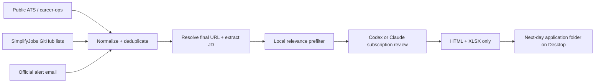

<div align="center">

# Daily Job Match Alert

**Subscription-only AI job discovery for Data and AI/ML candidates.**

Collect fresh roles from public ATS boards, curated GitHub lists, and official email alerts; compare every relevant JD against two resumes; wake up to a ranked local report.

[](https://github.com/JackyJiang08/daily-job-match-alert/actions/workflows/ci.yml)
[](LICENSE)


</div>

Daily Job Match Alert is a privacy-conscious, non-auto-apply pipeline for internships, new-grad positions, and entry-level full-time roles. It uses an authenticated **Codex CLI or Claude Code subscription** for semantic matching—never a pay-as-you-go model API.

## Why Daily Job Match Alert

Job boards fragment discovery across ATS pages, curated lists, account alerts, and email. A single generic resume score also hides whether a role fits a Data profile or an AI/ML profile better.

Daily Job Match Alert provides:

- Dual-resume evaluation with independent Data and AI/ML scores.
- Subscription-only semantic review with structured, auditable output.
- Public-source and official-alert ingestion without authenticated scraping.
- Exact `postedAt` versus first-seen `discoveredAt` semantics.
- Cross-source URL canonicalization and persistent deduplication.
- Failure-isolated collectors, retrying subscription batches, and visible report warnings instead of an empty nightly run.
- Exactly two user-facing files per successful application date: an HTML report with the complete captured JD and a compact 11-column XLSX with clickable posting links.
- Hard safety boundaries: no auto-apply, no screening answers, no mailbox mutation.

## Architecture



The local prefilter removes clearly unrelated roles before subscription review. Final report scores come from the configured subscription CLI; intermediate structured data stays in temporary local storage and is removed after XLSX creation.

## Supported discovery paths

| Source | Method | Access model |
|---|---|---|
| Greenhouse and other supported ATS | `career-ops` public providers and final employer links | Public endpoints |
| SimplifyJobs Summer Internships | Public GitHub README polling | Public repository |
| SimplifyJobs New Grad | Public GitHub README polling | Public repository |
| Handshake | Saved-search alert email | Official account feature |
| Simplify | Match-preference alert email | Official account feature |
| Wellfound | Saved-search alert email | Official account feature |
| ZipRecruiter | Job alert email | Official account feature |
| Jobright | Email alert when available; otherwise supplemental manual discovery | Official alert surface |

Daily Job Match Alert does not sign into or scrape Handshake, Jobright, Simplify, Wellfound, or ZipRecruiter. Alert email is a discovery mechanism; once a link resolves to a public employer ATS, the employer posting becomes the preferred source.

## Quick start

Requirements: macOS or Linux, Node.js 20+, a ChatGPT-authenticated Codex CLI or subscription-authenticated Claude Code, and optionally [career-ops](https://github.com/santifer/career-ops) and [Himalaya](https://github.com/pimalaya/himalaya).

```bash
git clone https://github.com/JackyJiang08/daily-job-match-alert.git
cd daily-job-match-alert
cp config.example.json config.json
cp resumes/data.example.md resumes/data.md
cp resumes/ai.example.md resumes/ai.md
```

Point `resumeSources.dataPdf` and `resumeSources.aiPdf` at your private PDFs, edit the preferences in `config.json`, then sign in to Claude Code with your Claude subscription:

```bash
claude auth login --claudeai
claude auth status --json

npm run resume:sync
npm test
npm run run
```

The default engine is `claude_subscription`. Choose the Claude.ai subscription flow—never `--console`, which is the API-billed path. If `claude` is outside the non-interactive system `PATH`, set `semanticMatching.claudeCommand` to its absolute executable path.

### Pinning and auditing the scoring model

`semanticMatching.model` is passed to `claude --model` (or `codex --model`). Use one of the Claude Code aliases—`fable`, `opus`, or `sonnet`, each resolving to the latest model in that family—or a full model name such as `claude-fable-5`. The example configuration pins `fable`.

Every batch response from `claude --print --output-format json` is parsed for the model that actually produced the scores (`modelUsage`, keyed by model id; the entry with the most output tokens is the scoring model). That value is recorded as `scoringModel` on each reviewed job, summarized as `meta.scoringModel`, and shown in the HTML header and the XLSX Run Summary as **Scoring model**. If the output does not identify a model, `scoringModel` is `unknown` and a warning is raised. If a configured model does not match the reported model after alias expansion (for example `fable` configured but `claude-sonnet-5` reported), the scores are still used for that run, but a `MODEL MISMATCH` warning appears in the HTML warning panel and the Run Summary so the configuration can be fixed.

## Private resume updates

`resumeSources.autoRefresh` makes resume updates non-fixed. Before every run, the project hashes both source PDFs and refreshes the gitignored `resumes/data.md` and `resumes/ai.md` whenever either PDF changes. Replacing a PDF at the same path requires no configuration change; if its filename or folder changes, update only your private `config.json`.

Real PDFs, extracted resume text, `config.json`, state, email, logs, and generated reports are excluded from Git. The public repository contains examples and extraction code only.

## Subscription-only cost guard

This is an enforced runtime boundary, not just a documentation promise:

- `codex_subscription` requires `codex login status` to explicitly report ChatGPT login.
- `claude_subscription` rejects missing or API-key authentication and is the default.
- OpenAI, Anthropic, Bedrock, Vertex, and Google API credential variables are removed from the model subprocess environment.
- There is no OpenAI Platform or Anthropic API client in the project.
- Authentication or supported-CLI-version failures fall back to local scoring and appear as report warnings; they never fall back to an API.

Subscription runs still count against the applicable ChatGPT or Claude plan limits.

## career-ops integration

[career-ops](https://github.com/santifer/career-ops) is a strong upstream engine for public ATS discovery, portal health, deduplication, and application pipeline management. Daily Job Match Alert stays separate so career-ops can update normally while this project retains full JD text, two resume tracks, semantic scores, and daily report state.

After onboarding career-ops and configuring `portals.yml`, enable `sources.careerOps` in `config.json` and point `scanHistoryPath` at its `data/scan-history.tsv`. Set `runScanFirst` to `true` only after `node scan.mjs --since 1` succeeds manually.

## Unattended email ingestion

For a smoke test, save `.eml` files under `intake/eml`. For a fully unattended workflow:

1. Create a dedicated `job-alerts` mailbox folder or label.
2. Route official job-alert messages into it.
3. Configure Himalaya with secure credentials: `himalaya account configure`.
4. Enable `sources.himalaya` in `config.json`.

The collector only lists envelopes and reads messages with `--preview`; it does not mark, move, delete, reply to, or send mail. Keep credentials in the OS keychain or a secure password command—not in this repository.

## Daily macOS schedule

Run the pipeline successfully once before installing the schedule. The default is every day at 20:00 America/Chicago.

```bash
chmod +x scripts/run-daily.sh scripts/install-launchd.sh
./scripts/install-launchd.sh 20 0
```

The deterministic runner uses `launchd`, so collection and report generation do not depend on an OpenClaw gateway staying awake. `RunAtLoad` is enabled: a normal 20:00 trigger performs the complete run, while a startup trigger uses the same logic exposed by `npm run run:catchup` and runs only when `state.lastSuccessfulRun` is more than 26 hours old. Through 14:00 local time, a late catch-up writes the current application date; later runs keep the next-day date. OpenClaw can still provide mailbox tooling or downstream notifications.

Concurrent invocations are guarded by `state/.lock`; a live owner causes the duplicate invocation to exit cleanly, and a stale PID is removed automatically. launchd output is stored in `state/logs/daily-YYYY-MM-DD.log`, with the newest 30 log files retained. A fatal error before the normal report can be completed writes `ERROR-YYYY-MM-DD.html` directly under the configured output directory and attempts a macOS notification.

## Reports and freshness

Each successful 20:00 Central Time run writes the **next application date** as a folder. For example, the August 27 evening run creates `2026-08-28/`. A successful folder contains only:

- `Daily Job Match Alert - 2026-08-28.html`
- `Daily Job Match Alert - 2026-08-28.xlsx`

No `latest.html`, CSV, JSON, inspection sidecar, or verification directory remains in the Desktop output.

The XLSX `Matches` sheet has 11 columns: Company, Title, Location, Role Type, Posted At, Data Score, AI Score, Recommended Resume, Why It Matches, Gaps / Verify, and Posting Link. The link cell shows the posting domain and opens the full URL; both score columns share a three-color scale. Rows that kept a local score because semantic review was unavailable start their **Why It Matches** text with `[unreviewed]`. The `Run Summary` sheet lists counts, the scoring model, and every warning. The HTML report keeps everything the sheet omits: the full captured JD in a collapsible section, salary, employment type, source, discovery time, and freshness basis.

- `postedAt` is populated only from employer or structured posting evidence.
- `discoveredAt` records when Daily Job Match Alert first encountered the canonical URL.
- GitHub list age is labeled approximate rather than presented as an exact timestamp.
- Hard-blocked and low-match roles are excluded from both user-facing files.
- Collector, enrichment, or subscription failures appear in a warning panel in HTML and in the XLSX Run Summary. Subscription batches retry once after 10 seconds; unresolved jobs keep their local score and are labeled `unreviewed`.
- Failed enrichment remains retryable across nightly runs. State records the attempt count and only closes the posting after three failed enrichment attempts, with each degraded attempt disclosed in the report.
- The XLSX writer is enabled by default. If XLSX generation fails, the run exits with code 1 but preserves the HTML report and seen state, and writes `XLSX-FAILED.txt` beside the HTML with the underlying error. A later successful rerun removes that marker and restores the two-file contract.

## Security and ethics

Real resumes, configuration, alert mail, state, logs, and generated reports are gitignored. Remote posting content is treated as untrusted input, including inside the subscription prompt. The subscription agent receives a temporary read-only workspace and no tools are requested for evaluation.

Daily Job Match Alert never submits applications or answers screening questions. See [SECURITY.md](SECURITY.md) and [CONTRIBUTING.md](CONTRIBUTING.md).

## Documentation

- [Chinese setup and source decision guide](SETUP.zh-CN.md)
- [Example configuration](config.example.json)
- [Contributing](CONTRIBUTING.md)
- [Security policy](SECURITY.md)

## Acknowledgements

Daily Job Match Alert is designed as a companion to [santifer/career-ops](https://github.com/santifer/career-ops) and consumes public lists maintained by [SimplifyJobs](https://github.com/SimplifyJobs). Their projects remain independent and retain their respective licenses and trademarks.

## License

[MIT](LICENSE) © 2026 Yuqing (Jacky) Jiang
