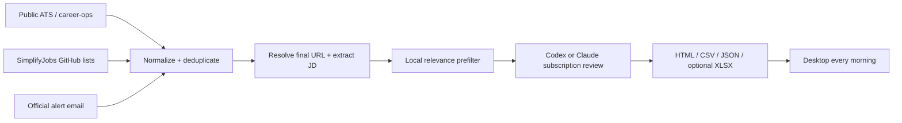

<div align="center">

# Daily Job Match Alert

**Subscription-only AI job discovery for Data and AI/ML candidates.**

Collect fresh roles from public ATS boards, curated GitHub lists, and official email alerts; compare every relevant JD against two resumes; wake up to a ranked local report.

[](https://github.com/JackyJiang08/daily-job-match-alert/actions/workflows/ci.yml)
[](LICENSE)


</div>

Daily Job Match Alert is a privacy-conscious, non-auto-apply pipeline for internships, new-grad positions, and entry-level full-time roles. It uses an authenticated **Codex CLI or Claude Code subscription** for semantic matching—never a pay-as-you-go model API.

## Why Daily Job Match Alert

Job boards fragment discovery across ATS pages, curated lists, account alerts, and email. A single generic resume score also hides whether a role fits a Data profile or an AI/ML profile better.

Daily Job Match Alert provides:

- Dual-resume evaluation with independent Data and AI/ML scores.
- Subscription-only semantic review with structured, auditable output.
- Public-source and official-alert ingestion without authenticated scraping.
- Exact `postedAt` versus first-seen `discoveredAt` semantics.
- Cross-source URL canonicalization and persistent deduplication.
- Daily HTML, CSV, and JSON reports; optional XLSX when a compatible writer is available.
- Hard safety boundaries: no auto-apply, no screening answers, no mailbox mutation.

## Architecture



The local prefilter removes clearly unrelated roles before subscription review. Final report scores come from the configured subscription CLI; local scores remain in JSON for audit.

## Supported discovery paths

| Source | Method | Access model |
|---|---|---|
| Greenhouse and other supported ATS | `career-ops` public providers and final employer links | Public endpoints |
| SimplifyJobs Summer Internships | Public GitHub README polling | Public repository |
| SimplifyJobs New Grad | Public GitHub README polling | Public repository |
| Handshake | Saved-search alert email | Official account feature |
| Simplify | Match-preference alert email | Official account feature |
| Wellfound | Saved-search alert email | Official account feature |
| ZipRecruiter | Job alert email | Official account feature |
| Jobright | Email alert when available; otherwise supplemental manual discovery | Official alert surface |

Daily Job Match Alert does not sign into or scrape Handshake, Jobright, Simplify, Wellfound, or ZipRecruiter. Alert email is a discovery mechanism; once a link resolves to a public employer ATS, the employer posting becomes the preferred source.

## Quick start

Requirements: macOS or Linux, Node.js 20+, a ChatGPT-authenticated Codex CLI or subscription-authenticated Claude Code, and optionally [career-ops](https://github.com/santifer/career-ops) and [Himalaya](https://github.com/pimalaya/himalaya).

```bash
git clone https://github.com/JackyJiang08/daily-job-match-alert.git
cd daily-job-match-alert
cp config.example.json config.json
cp resumes/data.example.md resumes/data.md
cp resumes/ai.example.md resumes/ai.md
```

Replace both resume placeholders, edit the preferences in `config.json`, then verify subscription authentication:

```bash
codex login status
# Must say: Logged in using ChatGPT

npm test
npm run run
```

The runner refuses placeholder resumes. For Claude Code, authenticate with a Claude subscription and set `semanticMatching.engine` to `claude_subscription`.

## Subscription-only cost guard

This is an enforced runtime boundary, not just a documentation promise:

- `codex_subscription` requires `codex login status` to explicitly report ChatGPT login.
- `claude_subscription` rejects missing or API-key authentication.
- OpenAI, Anthropic, Bedrock, Vertex, and Google API credential variables are removed from the model subprocess environment.
- There is no OpenAI Platform or Anthropic API client in the project.
- Authentication mismatch stops the run; it never falls back to an API.

Subscription runs still count against the applicable ChatGPT or Claude plan limits.

## career-ops integration

[career-ops](https://github.com/santifer/career-ops) is a strong upstream engine for public ATS discovery, portal health, deduplication, and application pipeline management. Daily Job Match Alert stays separate so career-ops can update normally while this project retains full JD text, two resume tracks, semantic scores, and daily report state.

After onboarding career-ops and configuring `portals.yml`, enable `sources.careerOps` in `config.json` and point `scanHistoryPath` at its `data/scan-history.tsv`. Set `runScanFirst` to `true` only after `node scan.mjs --since 1` succeeds manually.

## Unattended email ingestion

For a smoke test, save `.eml` files under `intake/eml`. For a fully unattended workflow:

1. Create a dedicated `job-alerts` mailbox folder or label.
2. Route official job-alert messages into it.
3. Configure Himalaya with secure credentials: `himalaya account configure`.
4. Enable `sources.himalaya` in `config.json`.

The collector only lists envelopes and reads messages with `--preview`; it does not mark, move, delete, reply to, or send mail. Keep credentials in the OS keychain or a secure password command—not in this repository.

## Daily macOS schedule

Run the pipeline successfully once before installing the schedule. Example: every day at 06:30 local time.

```bash
chmod +x scripts/run-daily.sh scripts/install-launchd.sh
./scripts/install-launchd.sh 6 30
```

The deterministic runner uses `launchd`, so collection and report generation do not depend on an OpenClaw gateway staying awake. OpenClaw can still provide mailbox tooling or downstream notifications.

## Reports and freshness

Each successful run writes a dated folder plus `latest.html` to the configured output directory. Rows include source, role type, company, title, location, Data score, AI score, recommended resume, match reasons, gaps, blockers, freshness basis, and original posting link.

- `postedAt` is populated only from employer or structured posting evidence.
- `discoveredAt` records when Daily Job Match Alert first encountered the canonical URL.
- GitHub list age is labeled approximate rather than presented as an exact timestamp.
- A hard-blocked role remains in the JSON audit record but is excluded from high-match reports.
- XLSX is optional and non-fatal; HTML, CSV, and JSON remain the portable baseline.

## Security and ethics

Real resumes, configuration, alert mail, state, logs, and generated reports are gitignored. Remote posting content is treated as untrusted input, including inside the subscription prompt. The subscription agent receives a temporary read-only workspace and no tools are requested for evaluation.

Daily Job Match Alert never submits applications or answers screening questions. See [SECURITY.md](SECURITY.md) and [CONTRIBUTING.md](CONTRIBUTING.md).

## Documentation

- [Chinese setup and source decision guide](SETUP.zh-CN.md)
- [Example configuration](config.example.json)
- [Contributing](CONTRIBUTING.md)
- [Security policy](SECURITY.md)

## Acknowledgements

Daily Job Match Alert is designed as a companion to [santifer/career-ops](https://github.com/santifer/career-ops) and consumes public lists maintained by [SimplifyJobs](https://github.com/SimplifyJobs). Their projects remain independent and retain their respective licenses and trademarks.

## License

[MIT](LICENSE) © 2026 Yuqing (Jacky) Jiang
